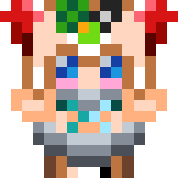

<h1 align=center> Neuro-Sama of Undying </h1>
<h4> Resourcepack for the Minecraft </h4>

 Bored with your usual Totem of Undying? Replace it with Neuro-Sama or her friends! 

 

<h4> Right now </h4>

- 2 versions of the resourcepack: **Neuro-Sama** and **Evilyn**
- 4 Alternatives for each version of the resourcepackk
- All supported versions of the Minecraft

<h4> Next steps </h4>

- [ ] Vedal and another persons
- [ ] Sounds

<h1> </h1>

<h6>
	<a href="https://creativecommons.org/licenses/by-nc-sa/4.0"> @CC BY-NC-SA 4.0 License </a>
     
     
    <a href="https://modrinth.com/resourcepack/neurosama-of-undying"> @Modrinth</a>
     
    <a href="https://github.com/ami-amai/neurosama-of-undying">@Github </a>
</h6>

